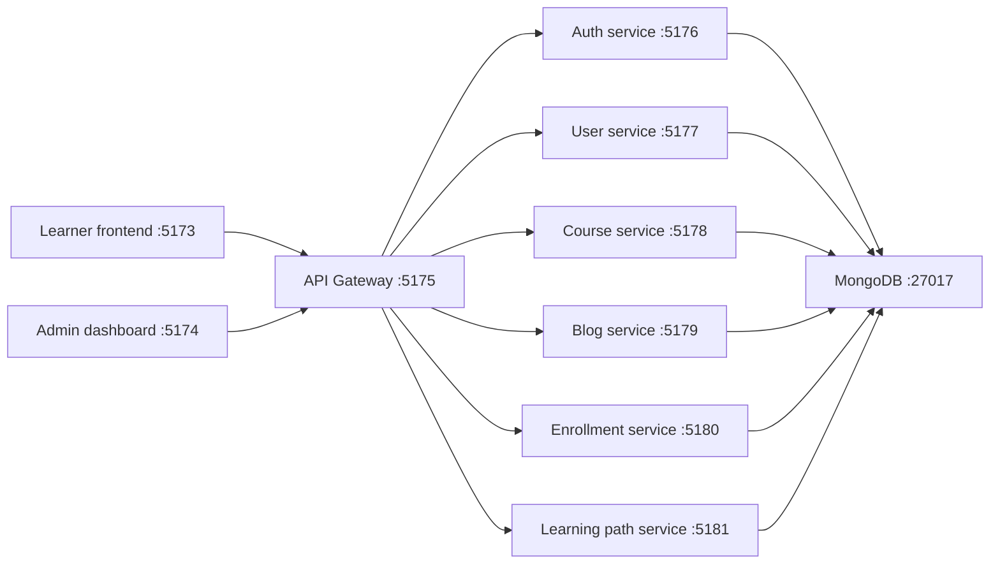

# Kiến trúc hệ thống

F8 Education Clone là monorepo gồm hai ứng dụng React ở phía client và backend
được tách thành API Gateway cùng các microservice Node.js.

## Luồng request



## Thành phần

| Thành phần | Trách nhiệm | Port |
| --- | --- | ---: |
| `frontend` | Giao diện học viên | `5173` |
| `admin` | Dashboard quản trị | `5174` |
| `api-gateway` | CORS, health check và proxy API | `5175` |
| `auth-service` | Đăng ký, đăng nhập, JWT | `5176` |
| `user-service` | Hồ sơ và dữ liệu người dùng | `5177` |
| `course-service` | Course, chapter và lesson | `5178` |
| `blog-service` | Bài viết và nội dung blog | `5179` |
| `enrollment-service` | Đăng ký khóa học | `5180` |
| `learning-path-service` | Lộ trình học tập | `5181` |
| MongoDB | Lưu trữ dữ liệu ứng dụng | `27017` |

## Cấu trúc backend

```text
backend/
├── src/api-gateway/       # Entry point cho client
├── src/services/          # Các service độc lập
└── src/shared/            # Config, middleware và utility dùng chung
```

Mỗi service có `src/index.js`, `package.json`, `package-lock.json` và Dockerfile
riêng. Các service dùng module trong `backend/src/shared` để tái sử dụng cấu
hình database, JWT, middleware và HTTP helper.

## Nguyên tắc giao tiếp

1. Frontend và admin chỉ gọi API Gateway.
2. Gateway định tuyến request theo prefix `/api` tới service tương ứng.
3. JWT được gửi qua header `Authorization: Bearer <token>`.
4. Service không nên phụ thuộc trực tiếp vào code của frontend hoặc admin.
5. Thay đổi endpoint cần cập nhật tài liệu API và service client tương ứng.
